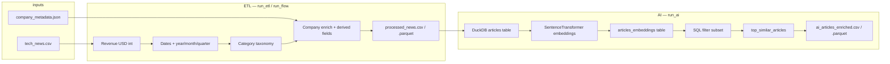

# Project walkthrough: yipit_work

This document expands on [README.md](README.md). It explains how the repository is organized, how to run the pipeline, and how execution flows from the entry point through ETL, embeddings, and semantic similarity export.

For design rationale (model choice, metadata fixes, trade-offs), see [EXPLAIN.md](EXPLAIN.md).

---

## Table of contents

1. [What this project does](#what-this-project-does)
2. [Repository layout](#repository-layout)
3. [Setup and running (from README)](#setup-and-running-from-readme)
4. [Entry point: `src/pipeline.py](#entry-point-srcpipelinepy)`
5. [End-to-end data flow](#end-to-end-data-flow)
6. [Phase 1 — ETL (`run_etl`)](#phase-1--etl-run_etl)
7. [Phase 2 — AI enrichment (`run_ai`)](#phase-2--ai-enrichment-run_ai)
8. [Semantic search APIs](#semantic-search-apis)
9. [Outputs and artifacts](#outputs-and-artifacts)
10. [Testing](#testing)
11. [Dependencies](#dependencies)
12. [Operational notes](#operational-notes)

---

## What this project does

**yipit_work** is an end-to-end pipeline that:

1. **Cleans and enriches** tech-news articles from a raw CSV with company metadata (ETL).
2. **Loads** the processed dataset into DuckDB.
3. **Generates** sentence embeddings for each article (title + summary).
4. **Filters** a subset of AI/ML-related, high-revenue articles (2022–2024).
5. **Computes** top similar articles within that filtered set and **exports** CSV and Parquet under `output/`.

The primary deliverable path (from README):

`**output/ai_articles_enriched.csv`** (relative to the repository root)

---

## Repository layout

```
yipit_work/
├── README.md                 # Quick start, commands, API snippets
├── EXPLAIN.md                # Design choices and trade-offs
├── PROJECT_WALKTHROUGH.md    # This document
├── requirements.txt
├── pytest.ini
├── create_venv.sh            # Create/activate Python 3.11 venv
├── install_deps.sh           # pip install -r requirements.txt
├── run_all.sh                # Shell wrapper around pipeline.py
├── data/
│   ├── raw/
│   │   ├── tech_news.csv
│   │   └── company_metadata.json
│   ├── processed/            # ETL outputs (created by pipeline)
│   │   ├── processed_news.csv
│   │   └── processed_news.parquet
│   └── tech_news.duckdb      # DuckDB file (created by AI phase)
├── output/                   # Final enriched export (AI phase)
│   ├── ai_articles_enriched.csv
│   └── ai_articles_enriched.parquet
├── src/
│   ├── pipeline.py           # ★ Unified entry point
│   ├── common/
│   │   └── logging_config.py
│   ├── etl/
│   │   ├── transform.py      # ETL orchestration (run_flow)
│   │   ├── revenue_utils.py
│   │   ├── dateutils.py
│   │   ├── category_taxonomy.py
│   │   └── enrich.py
│   └── ai/
│       ├── data_store.py     # DuckDB read/write/sql
│       ├── embeddings.py
│       └── similarity_search.py
└── tests/
    ├── etl/
    ├── ai/
    └── validate_datasets.py
```

---

## Setup and running (from README)

### Prerequisites

- **Python 3.11**

### Install

1. Create and activate a virtual environment (see `create_venv.sh`).
2. Install dependencies:
  ```shellscript
   pip install -r requirements.txt
  ```
   Or run `./install_deps.sh` after the venv exists.

### Run tests

From the repository root (with venv active and `pythonpath` set via `pytest.ini`):

```bash
pytest
```

### Run the workflow


| Command                                                   | Effect                                       |
| --------------------------------------------------------- | -------------------------------------------- |
| `./run_all.sh`                                            | Full run: ETL then AI (default mode `all`)   |
| `./run_all.sh etl`                                        | ETL only                                     |
| `./run_all.sh ai`                                         | AI only (expects processed Parquet from ETL) |
| `PYTHONPATH=$PYTHONPATH:$(pwd) python src/pipeline.py -h` | CLI help                                     |
| `python src/pipeline.py etl`                              | ETL only                                     |
| `python src/pipeline.py ai`                               | AI only                                      |
| `python src/pipeline.py` or `python src/pipeline.py all`  | Both phases                                  |


`run_all.sh` activates `.venv`, appends the repo root to `PYTHONPATH`, optionally deletes prior artifacts, then invokes `src/pipeline.py`.

---

## Entry point: `src/pipeline.py`

All production flows go through `**src/pipeline.py**`. It wires ETL and AI subsystems and exposes a small CLI.

### Imports and configuration

On import, `src.common.logging_config` configures root logging once (`INFO` level, file/line in format). The repo root is resolved as `ROOT` (parent of `src/`).

### CLI: `main()`

```text
python src/pipeline.py [etl | ai | all]
```


| Mode            | Calls                       | When to use                                     |
| --------------- | --------------------------- | ----------------------------------------------- |
| `etl`           | `run_etl()` only            | Refresh `data/processed/*` from raw inputs      |
| `ai`            | `run_ai()` only             | Embeddings + export; requires processed Parquet |
| `all` (default) | `run_etl()` then `run_ai()` | Full pipeline                                   |


```80:97:src/pipeline.py
def main() -> None:
    parser = argparse.ArgumentParser(description="Run ETL, AI pipeline, or both.")
    parser.add_argument(
        "mode",
        nargs="?",
        default="all",
        choices=("etl", "ai", "all"),
        help="etl: transform only; ai: embeddings + export; all: etl then ai (default)",
    )
    args = parser.parse_args()

    if args.mode in ("etl", "all"):
        run_etl()
    if args.mode in ("ai", "all"):
        pd.set_option("display.max_columns", None)
        pd.set_option("display.width", None)
        pd.set_option("display.max_colwidth", None)
        run_ai()
```

### High-level functions


| Function              | Role                                                          |
| --------------------- | ------------------------------------------------------------- |
| `run_etl()`           | Read raw CSV + metadata JSON → `run_flow()` → processed files |
| `run_ai()`            | Load Parquet → DuckDB → embeddings → export                   |
| `export_final_file()` | SQL filter on `articles_embeddings` → enriched CSV/Parquet    |


---

## End-to-end data flow




---

## Phase 1 — ETL (`run_etl`)

### Step 0: Entry from pipeline

```20:25:src/pipeline.py
def run_etl() -> None:
    logger.info("Starting ETL pipeline")
    raw_csv_path = ROOT / "data" / "raw" / "tech_news.csv"
    metadata_json_path = ROOT / "data" / "raw" / "company_metadata.json"
    run_flow(raw_csv_path, metadata_json_path)
    logger.info("ETL pipeline completed")
```

### Step 1: `run_flow` — load and validate

**Module:** `src/etl/transform.py`

- Reads `tech_news.csv` into a pandas DataFrame.
- Requires columns: `revenue`, `category`, `published_date`, `company_name`.

### Step 2: Revenue normalization

**Module:** `src/etl/revenue_utils.py` — `dollar_revenue()`

- Parses currency symbols and multipliers (K/M/B).
- Converts EUR, GBP, JPY to approximate USD using fixed rates.
- Missing or undisclosed values map to a sentinel integer (see tests in `tests/etl/test_revenu_utils.py`).
- Result: `revenue` column as **USD integer**.

### Step 3: Published dates

**Module:** `src/etl/dateutils.py`

- `parse_published_date()` — flexible parsing via `dateutil`.
- `calendar_parts()` — derives `year`, `month`, `quarter`.
- Preserves raw string in `original_published_date`.
- Column order is adjusted so date-related fields group logically (`_process_publish_data`).

### Step 4: Category taxonomy

**Module:** `src/etl/category_taxonomy.py` — `canonical_category()`

- Maps varied raw labels (e.g. `"AI/ML"`, `"Artificial Intelligence"`) to stable codes such as `AI_ML`, `CLOUD`, `SECURITY`.
- Unmapped values pass through or normalize per `RAW_TO_TAXONOMY` (see tests in `tests/etl/test_category_taxonomy.py`).

### Step 5: Company enrichment

**Module:** `src/etl/enrich.py` — `CompanyEnrich`

1. **Load metadata** from JSON (`orient="index"` style: company name → fields).
2. **Data quality fix:** if `stock_ticker` is set but `is_public` is false, set `is_public` to true (see EXPLAIN.md).
3. **Canonicalize** `company_name` via:
  - Exact match to metadata keys
  - Static aliases (`COMPANY_ALIAS`, e.g. `"aws"` → `"Amazon Web Services"`)
  - Fuzzy match on aliases (`rapidfuzz`, threshold 80)
  - Otherwise `"UNKNOWN"`
4. **Left merge** metadata onto news rows on canonical name.
5. **Derived fields:**
  - `company_age` = publication year − `founded_year` (invalid negative → NA)
  - `company_size_category` from `employee_count` (Small / Medium / Large / Unknown)

Unmatched names are collected via `unmatched_names()` and logged as a warning if any remain.

### Step 6: Persist processed data

Writes to (by default):

- `data/processed/processed_news.csv`
- `data/processed/processed_news.parquet`

Parquet is the format the AI phase reads (`data_store.load_cleaned_data`).

---

## Phase 2 — AI enrichment (`run_ai`)

### Step 1: Load cleaned data into DuckDB

**Module:** `src/ai/data_store.py`

```29:48:src/ai/data_store.py
def run_ai() -> None:
    ...
```

`load_cleaned_data()`:

1. Reads `data/processed/processed_news.parquet`.
2. `write()` replaces DuckDB table `**articles**` at `data/tech_news.duckdb`.

### Step 2: Read and embed

**Module:** `src/ai/embeddings.py`

- Builds `text_for_embedding` = `title` + `" "` + `summary`.
- Model: `**all-MiniLM-L6-v2`** (lazy-loaded singleton via `load_sentence_transformer()`).
- Adds column `embedding` (list of floats per row).

### Step 3: Persist embeddings table

- `db.write(df_with_embeddings, table_name="articles_embeddings")`.

### Step 4: Filter and export (`export_final_file`)

**Module:** `src/pipeline.py` + `src/ai/similarity_search.py`

`export_final_file()` runs SQL against `articles_embeddings` with filters:


| Filter  | Rule                                              |
| ------- | ------------------------------------------------- |
| Topic   | `category` **or** `industry` in AI-related labels |
| Year    | `year` between 2022 and 2024                      |
| Revenue | `revenue >= 50_000_000` (USD)                     |


Selected columns include article fields, company metadata, and `embedding`.

Then `export_with_top_similar_articles(query, output_path)`:

1. `db.sql(query)` → filtered DataFrame.
2. `add_top_similar_articles(df, top_k=3)` — pairwise cosine similarity **within that DataFrame**; for each row, top 3 other `article_id`s (excluding self).
3. Writes `**output/ai_articles_enriched.csv`** and `**.parquet**`.

**Design note:** Similarity for export is scoped to the filtered subset, not the full corpus (see EXPLAIN.md).

---

## Semantic search APIs

Beyond the batch export, `src/ai/similarity_search.py` exposes query-time helpers (used in tests and programmatically):


| Function                                                   | Behavior                                                                                |
| ---------------------------------------------------------- | --------------------------------------------------------------------------------------- |
| `find_similar_articles(query_text, top_k=5)`               | Encode `query_text`; cosine similarity vs all rows in default `articles` table          |
| `hybrid_search(query_text, sql_query, top_k=5)`            | Run SQL first, then similarity on the result set                                        |
| `find_similar_articles_by_artical_id(...)`                 | Similarity scoped to one article row (note: parameter name typo `artical_id` in source) |
| `export_with_top_similar_articles(sql_query, output_path)` | SQL → add `top_similar_articles` → CSV + Parquet                                        |


Core logic lives in `embeddings.find_similar_articles` and `embeddings.add_top_similar_articles` using `sklearn.metrics.pairwise.cosine_similarity`.

### DuckDB helpers (from README)

**Module:** `src/ai/data_store.py`

```python
read(table_name="articles")   # SELECT * FROM table
sql(query)                    # arbitrary SQL → DataFrame
write(df, table_name=...)     # CREATE OR REPLACE TABLE
```

Default database path: `**data/tech_news.duckdb**`.

---

## Outputs and artifacts


| Artifact                                | Produced by | Purpose                                                    |
| --------------------------------------- | ----------- | ---------------------------------------------------------- |
| `data/processed/processed_news.csv`     | ETL         | Human-readable cleaned dataset                             |
| `data/processed/processed_news.parquet` | ETL         | Input to AI phase                                          |
| `data/tech_news.duckdb`                 | AI          | `articles`, `articles_embeddings` tables                   |
| `output/ai_articles_enriched.csv`       | AI export   | Final deliverable with embeddings + `top_similar_articles` |
| `output/ai_articles_enriched.parquet`   | AI export   | Same data, columnar                                        |


Enriched export columns (from export SQL) include: `article_id`, `title`, `company_name`, `published_date`, `category`, `revenue_usd`, `summary`, `url`, `industry`, `founded_year`, `headquarters`, `employee_count`, `is_public`, `stock_ticker`, `company_age`, `company_size_category`, `embedding`, plus `**top_similar_articles**` added in Python.

---

## Testing

`pytest.ini` sets `pythonpath = .` so imports use the `src` package layout.


| Area           | Test files                            |
| -------------- | ------------------------------------- |
| ETL revenue    | `tests/etl/test_revenu_utils.py`      |
| ETL dates      | `tests/etl/test_datauitls.py`         |
| ETL categories | `tests/etl/test_category_taxonomy.py` |
| ETL enrich     | `tests/etl/test_enrich.py`            |
| AI store       | `tests/ai/test_data_store.py`         |
| AI embeddings  | `tests/ai/test_embeddings.py`         |
| Dataset checks | `tests/validate_datasets.py`          |


As noted in README, each module is intended to have a matching `test_<module>.py` that documents expected behavior.

---

## Dependencies

Key libraries from `requirements.txt`:


| Package                           | Role in this project        |
| --------------------------------- | --------------------------- |
| `pandas` / `pyarrow`              | DataFrames, CSV/Parquet I/O |
| `duckdb`                          | Embedded analytics DB       |
| `sentence-transformers` / `torch` | Embedding model             |
| `scikit-learn`                    | Cosine similarity           |
| `rapidfuzz`                       | Company name fuzzy matching |
| `python-dateutil`                 | Date parsing                |
| `pytest`                          | Tests                       |


---

## Operational notes

1. `**PYTHONPATH`:** Run pipeline and tests from the repo root with the project on the path (as `run_all.sh` and `pytest.ini` do).
2. `**run_all.sh` cleanup paths:** The script removes `data/db/tech_news.duckdb`, but `data_store.py` uses `**data/tech_news.duckdb`**. If you need a clean DuckDB file, delete `data/tech_news.duckdb` manually or align the script with the code path.
3. **Export SQL in `export_final_file`:** The `SELECT` list in `pipeline.py` includes a trailing comma after `embedding` before `FROM`, which is invalid SQL in standard parsers. If export fails, remove that trailing comma.
4. **AI-only runs:** `python src/pipeline.py ai` requires existing `data/processed/processed_news.parquet` from a prior ETL run.
5. **First AI run:** Downloading `all-MiniLM-L6-v2` may take time and disk space on first use.
6. **Further reading:** [EXPLAIN.md](EXPLAIN.md) — model choice, metadata `is_public`/`stock_ticker` handling, category vs industry join decision, and top-K trade-offs.

---

## Quick reference: call chain

```text
./run_all.sh [etl|ai|all]
  └── src/pipeline.py main()
        ├── run_etl()
        │     └── src.etl.transform.run_flow()
        │           ├── revenue_utils.dollar_revenue
        │           ├── dateutils.parse_published_date / calendar_parts
        │           ├── category_taxonomy.canonical_category
        │           └── enrich.CompanyEnrich.enrich
        └── run_ai()
              ├── data_store.load_cleaned_data → write(articles)
              ├── data_store.read()
              ├── embeddings.generate_embeddings
              ├── data_store.write(articles_embeddings)
              └── export_final_file()
                    └── similarity_search.export_with_top_similar_articles
                          ├── data_store.sql
                          └── embeddings.add_top_similar_articles
```

This is the full path from README’s entry point to the enriched CSV documented in the README.